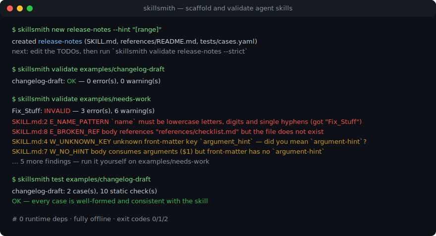
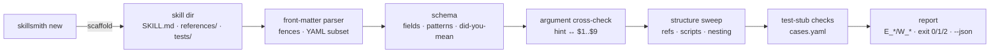

# skillsmith

[English](README.md) | [中文](README.zh.md) | [日本語](README.ja.md)

[](LICENSE)   [](CONTRIBUTING.md)

**エージェントスキルのためのオープンソースの鍛冶場 — どこでも読み込まれ、最初の一秒から検証を通る SKILL.md パッケージをスキャフォールドする：front-matter スキーマ、ディレクトリ構造、引数プレースホルダ、そしてオフライン検査可能なテストスタブ。**



```bash
# not yet on npm — install from a checkout of this repository
npm install && npm run build && npm pack
npm install -g ./skillsmith-0.1.0.tgz
```

## なぜ skillsmith？

エージェントスキルは今まさにプラグインのゴールドラッシュだが、そのほぼ全部が手作りだ：`SKILL.md` の front-matter は記憶頼りに打たれ、`argument_hint` は音もなく無視され、description は*いつ*発火すべきかを一度も語らず、本文がリンクする `references/style.md` は 2 コミット前に改名済み。ランタイムは文句を言わない — スキルを黙ってスキップするか、半壊れのまま読み込み、作者は困惑したユーザーから知らされる。汎用ツールはここをカバーしない：YAML リンタは構文を見るだけでスキルのスキーマは見ない、front-matter パーサはパースして肩をすくめる、skillscan のような監査スキャナは*サードパーティ*のスキルを事後に裁く。skillsmith は作り手の側に立つ：`new` は最初の一秒から検証を通るスキルを生成し、`validate` は安定したエラーコードと did-you-mean 提案でスキーマ・構造・引数配線・参照を突き合わせ、`test` は機械検査可能な評価ケースのスタブを正直に保つ — すべてオフライン、依存ゼロで。

|  | skillsmith | 手作り | yamllint / 汎用 YAML lint | gray-matter（パーサ） | skillscan（監査） |
|---|---|---|---|---|---|
| 主な仕事 | スキルの作成 + 検証 | — | YAML 構文 | front-matter の分離 | サプライチェーンリスク |
| スキルスキーマ（name/description/tools） | 完全・型付き・行番号付きエラー | 記憶頼り | なし | なし | 部分的 |
| argument-hint ↔ `$1..$9` の突き合わせ | あり | なし | なし | なし | なし |
| 壊れた `references/` リンク | あり | 本番で発覚 | なし | なし | なし |
| スキルのテストスタブ | 生成 + 検査 | ほぼ書かれない | なし | なし | なし |
| タイポ提案（`argument_hint`？） | あり | — | なし | なし | なし |
| ランタイムの重さ | Node、依存 0 | — | Python | npm 依存あり | Node |

<sub>各プロジェクトの特徴づけは公開ドキュメントに基づく（2026-07）。skillscan は補完関係にある監査側ツール：インストールするスキルを検査するのが skillscan、出荷するスキルを鍛えるのが skillsmith。</sub>

## 特長

- **生成した瞬間から検証を通るスキャフォールド** — `skillsmith new` はトリガー形の description を持つ front-matter を書き、`argument-hint` を実際の `$ARGUMENTS` プレースホルダに配線し、テストスタブも同梱する；残された TODO は本物を書くまで `--strict` に出荷を拒ませる。
- **雰囲気ではなく本物のスキーマ** — 必須フィールド、name のパターンと長さ制限、ツールエントリの形、型付き `metadata`、`x-` 拡張の逃げ道；すべてのルールに安定した `E_*`/`W_*` コードと file:line アンカーが付く（[docs/schema.md](docs/schema.md) 参照）。
- **タイポしたキーに did-you-mean** — `argument_hint` や `alowed-tools` の類には編集距離ベースの提案が返る。ランタイムのように黙って無視されることはない。
- **引数配線の突き合わせ** — 誰も消費しないヒント、`$2` なしの `$3`、ヒントが宣言しないプレースホルダ：ユーザーが呼び出し時にしか踏めない食い違いを、書いている時点で捕まえる。
- **構造と参照の掃除** — 壊れた `references/` リンク、本文が一度も触れない同梱ファイル、shebang のない `scripts/`、入れ子の SKILL.md、name とディレクトリの不一致。
- **オフライン検査可能なテストスタブ** — `tests/cases.yaml` に prompt・args・期待値を記す；`skillsmith test` は各ケースが整形式で一意、引数の数が整合し、実際に同梱されるファイルだけを期待していることを検証する — 評価実行がトークンを焼く前に腐敗を捕まえる。
- **ランタイム依存ゼロ、完全オフライン** — 必要なのは Node.js だけ；skillsmith はローカルファイルの読み書きのみでソケットを一切開かず、devDependency は `typescript` ただ一つ。

## クイックスタート

スキルを鍛える（実際のキャプチャ出力）：

```text
$ skillsmith new release-notes --hint "[range]" --tools "Bash(git log:*),Read"
created release-notes (SKILL.md, references/README.md, tests/cases.yaml)
next: edit the TODOs, then run `skillsmith validate release-notes --strict`
```

手作りのスキルを検証する（実際のキャプチャ出力、対象は [examples/needs-work](examples/README.md)）：

```text
$ skillsmith validate examples/needs-work
Fix_Stuff: INVALID — 3 error(s), 6 warning(s)
  SKILL.md E_NAME_MISMATCH front-matter name "Fix_Stuff" does not match directory name "needs-work"
  SKILL.md:2 E_NAME_PATTERN `name` must be lowercase letters, digits and single hyphens (got "Fix_Stuff")
  SKILL.md:8 E_BROKEN_REF body references "references/checklist.md" but the file does not exist
  W_NO_TESTS no tests/cases.yaml; scaffold one with `skillsmith new` or write it by hand
  SKILL.md:3 W_DESC_NO_TRIGGER `description` never says when to use the skill; add a "Use when ..." clause so it triggers
  SKILL.md:3 W_DESC_SHORT `description` is only 12 characters; the model picks skills by this text
  SKILL.md:4 W_UNKNOWN_KEY unknown front-matter key `argument_hint` — did you mean `argument-hint`?
  SKILL.md:7 W_NO_HINT body consumes arguments ($1) but front-matter has no `argument-hint`
  SKILL.md:10 W_PLACEHOLDER leftover TODO/FIXME/TBD placeholder
1 skill(s) checked, 1 with findings
```

健全な方も正直なままに保つ（実際のキャプチャ出力、対象は [examples/changelog-draft](examples/changelog-draft/SKILL.md)）：

```text
$ skillsmith test examples/changelog-draft
changelog-draft: 2 case(s), 10 static check(s)
OK — every case is well-formed and consistent with the skill
```

## skillsmith CLI

| コマンド | 内容 | 終了コード |
|---|---|---|
| `new <name>` | SKILL.md + references/ + テストスタブを生成（`--hint`、`--tools`、`--force` など） | 0、拒否時 2 |
| `validate <path>...` | スキーマ + 構造 + 引数 + 参照 + スタブ；スキルのツリーを丸ごと走査 | 0 クリーン / 1 指摘あり / 2 読めない |
| `validate --strict` | 警告も失敗扱い — 公開前のゲート | 0 / 1 / 2 |
| `list [<dir>]` | ディレクトリ（既定 `.`）配下の全スキルを判定付きで発見 | 0 / 2 |
| `info <path>` | パース済みメタデータ、引数の使用状況、ケース数 | 0 / 1 / 2 |
| `test <path>` | `tests/cases.yaml` のオフライン検査 | 0 合格 / 1 不合格 / 2 読めない |

すべてのコマンドは `--json` で機械可読な出力に対応し、CLI ができることはすべて型付きプログラマティック API（`validateSkill`、`scaffoldSkill`、`parseFrontmatter`、`discoverSkills` など）としてパッケージルートから提供される。

## 何を検査するか

フィールドごとの完全なスキーマ、バリデータの全 26 診断とテストスタブの 11 診断は [docs/schema.md](docs/schema.md) にある。front-matter が受け付ける YAML サブセットは意図的に退屈だ — アンカー、エイリアス、タグ、フローマッピングは行番号付きエラーで拒否される。どうせどこかのエージェントランタイムが詰まるからだ。`skillsmith test` はモデルを一切呼ばない：オフラインで判定可能な検査だけを実行し、モデルが必要な残り半分は同じ `cases.yaml` を読むあなたの評価ハーネスに委ねる。

## アーキテクチャ



## ロードマップ

- [x] スキャフォールダ、front-matter YAML サブセットパーサ、did-you-mean 付きフィールドスキーマ、引数突き合わせ、構造/参照の掃除、オフラインテストスタブ検査、ツリー発見、JSON 出力（v0.1.0）
- [ ] `skillsmith fix` — 機械的な指摘の自動適用（キーのリネーム、ヒント追加、死にファイル削除）
- [ ] プラグインマニフェスト対応：スキル一式とそのマニフェストを一度に検証
- [ ] ランタイムプロファイル（`--profile <runtime>`）で特定ホストが受け付けるキーにスキーマを絞る
- [ ] `cases.yaml` を実際のエージェントに流して期待値と突き合わせるアダプタ

完全なリストは [open issues](https://github.com/JaydenCJ/skillsmith/issues) を参照。

## コントリビュート

コントリビューション歓迎。`npm install && npm run build` でビルドし、`npm test`（91 テスト）と `bash scripts/smoke.sh`（`SMOKE OK` を出力すること）を実行 — このリポジトリは CI を同梱せず、上記の主張はすべてローカル実行で検証されている。[CONTRIBUTING.md](CONTRIBUTING.md) を読み、[good first issue](https://github.com/JaydenCJ/skillsmith/issues?q=is%3Aissue+is%3Aopen+label%3A%22good+first+issue%22) を掴むか、[discussion](https://github.com/JaydenCJ/skillsmith/discussions) を始めよう。

## ライセンス

[MIT](LICENSE)
