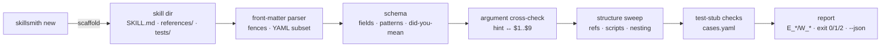

# skillsmith

[English](README.md) | [中文](README.zh.md) | [日本語](README.ja.md)

[](LICENSE)   [](CONTRIBUTING.md)

**An open-source forge for agent skills — scaffold SKILL.md packages that load everywhere and validate from the first second: front-matter schema, directory structure, argument placeholders, and offline-checkable test stubs.**


```bash
# not yet on npm — install from a checkout of this repository
npm install && npm run build && npm pack
npm install -g ./skillsmith-0.1.0.tgz
```

## Why skillsmith?

Agent skills are the current plugin gold rush, and almost every one of them is hand-rolled: a `SKILL.md` with front-matter typed from memory, where `argument_hint` silently does nothing, the description never says *when* to trigger, and the `references/style.md` the body links to was renamed two commits ago. Runtimes don't complain — they just quietly skip the skill or load it half-broken, and the author finds out from a confused user. Generic tools don't cover this: YAML linters check syntax, not the skill schema; front-matter parsers parse and shrug; and audit scanners like skillscan judge *third-party* skills after the fact. skillsmith is the authoring side: `new` scaffolds a skill that validates from the first second, `validate` cross-checks schema, structure, argument wiring and references with stable error codes and did-you-mean suggestions, and `test` keeps a machine-checkable stub of eval cases honest — all offline, zero dependencies.

|  | skillsmith | by hand | yamllint / generic YAML lint | gray-matter (parser) | skillscan (audit) |
|---|---|---|---|---|---|
| Primary job | author + validate skills | — | YAML syntax | split front-matter | supply-chain risk |
| Skill schema (name/description/tools) | full, typed, lined errors | memory | no | no | partial |
| Argument-hint ↔ `$1..$9` cross-check | yes | no | no | no | no |
| Broken `references/` links | yes | found in prod | no | no | no |
| Test stubs for skills | scaffolds + checks | rarely written | no | no | no |
| Typo suggestions (`argument_hint`?) | yes | — | no | no | no |
| Runtime footprint | Node, 0 dependencies | — | Python | npm deps | Node |

<sub>Characterizations based on each project's public documentation, 2026-07. skillscan is the complementary audit-side tool: it inspects skills you install; skillsmith forges the ones you ship.</sub>

## Features

- **Scaffold that validates immediately** — `skillsmith new` writes front-matter with a trigger-shaped description, wires `argument-hint` to a real `$ARGUMENTS` placeholder, and drops a test stub; the TODOs it leaves make `--strict` refuse to ship it until you write the real thing.
- **A real schema, not vibes** — required fields, name pattern and length limits, tool-entry shapes, typed `metadata`, `x-` extension escape hatch; every rule has a stable `E_*`/`W_*` code and a file:line anchor (see [docs/schema.md](docs/schema.md)).
- **Did-you-mean for typo'd keys** — `argument_hint`, `alowed-tools` and friends get an edit-distance suggestion instead of being silently ignored the way runtimes do.
- **Argument wiring cross-checked** — hints nobody consumes, `$3` without `$2`, placeholders the hint never advertises: the mismatches users only hit at invocation time are caught at author time.
- **Structure and reference sweeps** — broken `references/` links, bundled files the body never mentions, shebang-less `scripts/`, nested SKILL.md, and name/directory disagreement.
- **Offline-checkable test stubs** — `tests/cases.yaml` names prompts, args and expectations; `skillsmith test` verifies every case is well-formed, unique, arity-consistent and expects only files that actually ship — before an eval run burns tokens on rot.
- **Zero runtime dependencies, fully offline** — Node.js is the only requirement; skillsmith reads and writes local files, never opens a socket, and `typescript` is the sole devDependency.

## Quickstart

Forge a skill (real captured run):

```text
$ skillsmith new release-notes --hint "[range]" --tools "Bash(git log:*),Read"
created release-notes (SKILL.md, references/README.md, tests/cases.yaml)
next: edit the TODOs, then run `skillsmith validate release-notes --strict`
```

Validate someone's hand-rolled skill (real captured run, against [examples/needs-work](examples/README.md)):

```text
$ skillsmith validate examples/needs-work
Fix_Stuff: INVALID — 3 error(s), 6 warning(s)
  SKILL.md E_NAME_MISMATCH front-matter name "Fix_Stuff" does not match directory name "needs-work"
  SKILL.md:2 E_NAME_PATTERN `name` must be lowercase letters, digits and single hyphens (got "Fix_Stuff")
  SKILL.md:8 E_BROKEN_REF body references "references/checklist.md" but the file does not exist
  W_NO_TESTS no tests/cases.yaml; scaffold one with `skillsmith new` or write it by hand
  SKILL.md:3 W_DESC_NO_TRIGGER `description` never says when to use the skill; add a "Use when ..." clause so it triggers
  SKILL.md:3 W_DESC_SHORT `description` is only 12 characters; the model picks skills by this text
  SKILL.md:4 W_UNKNOWN_KEY unknown front-matter key `argument_hint` — did you mean `argument-hint`?
  SKILL.md:7 W_NO_HINT body consumes arguments ($1) but front-matter has no `argument-hint`
  SKILL.md:10 W_PLACEHOLDER leftover TODO/FIXME/TBD placeholder
1 skill(s) checked, 1 with findings
```

Then keep the healthy one honest (real captured run, against [examples/changelog-draft](examples/changelog-draft/SKILL.md)):

```text
$ skillsmith test examples/changelog-draft
changelog-draft: 2 case(s), 10 static check(s)
OK — every case is well-formed and consistent with the skill
```

## The skillsmith CLI

| Command | Does | Exit codes |
|---|---|---|
| `new <name>` | scaffold SKILL.md + references/ + test stub (`--hint`, `--tools`, `--force`, ...) | 0, 2 on refusal |
| `validate <path>...` | schema + structure + arguments + refs + stub; walks trees of skills | 0 clean / 1 findings / 2 unreadable |
| `validate --strict` | warnings fail too — the pre-publish gate | 0 / 1 / 2 |
| `list [<dir>]` | discover every skill under a directory (default `.`), with verdicts | 0 / 2 |
| `info <path>` | parsed metadata, argument usage, case count | 0 / 1 / 2 |
| `test <path>` | offline checks for `tests/cases.yaml` | 0 pass / 1 fail / 2 unreadable |

Every command takes `--json` for machine-readable output, and everything the CLI does is also a typed programmatic API (`validateSkill`, `scaffoldSkill`, `parseFrontmatter`, `discoverSkills`, ...) exported from the package root.

## What gets checked

The full field-by-field schema, all 26 validator diagnostics and the 11 test-stub diagnostics live in [docs/schema.md](docs/schema.md). The YAML subset accepted in front-matter is deliberately boring — anchors, aliases, tags and flow mappings are rejected with a lined error, because some agent runtime would have choked on them anyway. `skillsmith test` never calls a model: it runs exactly the checks that are decidable offline and leaves the model-in-the-loop half to your eval harness, reading the same `cases.yaml`.

## Architecture



## Roadmap

- [x] Scaffolder, front-matter YAML subset parser, field schema with did-you-mean, argument cross-checks, structure/reference sweeps, offline test-stub checks, tree discovery, JSON output (v0.1.0)
- [ ] `skillsmith fix` — auto-apply the mechanical findings (rename keys, add hints, drop dead files)
- [ ] Plugin-manifest awareness: validate a whole plugin of skills plus its manifest in one run
- [ ] Runtime profiles (`--profile <runtime>`) tightening the schema to a specific host's accepted keys
- [ ] An adapter that runs `cases.yaml` against a live agent and diffs expectations

See the [open issues](https://github.com/JaydenCJ/skillsmith/issues) for the full list.

## Contributing

Contributions are welcome. Build with `npm install && npm run build`, then run `npm test` (91 tests) and `bash scripts/smoke.sh` (must print `SMOKE OK`) — this repository ships no CI, every claim above is verified by local runs. See [CONTRIBUTING.md](CONTRIBUTING.md), grab a [good first issue](https://github.com/JaydenCJ/skillsmith/issues?q=is%3Aissue+is%3Aopen+label%3A%22good+first+issue%22), or start a [discussion](https://github.com/JaydenCJ/skillsmith/discussions).

## License

[MIT](LICENSE)
