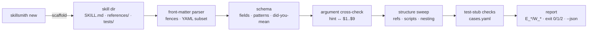

# skillsmith

[English](README.md) | [中文](README.zh.md) | [日本語](README.ja.md)

[](LICENSE)   [](CONTRIBUTING.md)

**开源的 agent skill 锻造台 —— 脚手架生成到处都能加载、从第一秒起就通过校验的 SKILL.md 包：front-matter 模式、目录结构、参数占位符，以及可离线检查的测试桩。**


```bash
# not yet on npm — install from a checkout of this repository
npm install && npm run build && npm pack
npm install -g ./skillsmith-0.1.0.tgz
```

## 为什么选 skillsmith？

Agent skill 是当下的插件淘金热，而几乎每一个都是手搓的：`SKILL.md` 的 front-matter 靠记忆敲出来，`argument_hint` 悄无声息地不起作用，description 从不说*什么时候*该触发，正文里链接的 `references/style.md` 早在两个提交前就被改名了。运行时不会报错——它们只是默默跳过这个 skill，或者半残地加载，作者要等到用户一脸困惑才知道。通用工具管不了这些：YAML linter 检查语法而不是 skill 模式；front-matter 解析器解析完就耸耸肩；skillscan 这类审计扫描器则是在事后评判*第三方*的 skill。skillsmith 站在创作侧：`new` 生成从第一秒就能通过校验的 skill，`validate` 用稳定错误码和 did-you-mean 建议交叉检查模式、结构、参数接线和引用，`test` 让机器可查的评测用例桩保持诚实——全部离线、零依赖。

|  | skillsmith | 纯手搓 | yamllint / 通用 YAML lint | gray-matter（解析器） | skillscan（审计） |
|---|---|---|---|---|---|
| 核心职责 | 创作 + 校验 skill | — | YAML 语法 | 切分 front-matter | 供应链风险 |
| Skill 模式（name/description/tools） | 完整、带类型、带行号报错 | 靠记忆 | 无 | 无 | 部分 |
| argument-hint ↔ `$1..$9` 交叉检查 | 有 | 无 | 无 | 无 | 无 |
| 失效的 `references/` 链接 | 有 | 上线后才发现 | 无 | 无 | 无 |
| Skill 的测试桩 | 生成 + 检查 | 几乎没人写 | 无 | 无 | 无 |
| 拼写建议（`argument_hint`？） | 有 | — | 无 | 无 | 无 |
| 运行时开销 | Node，0 依赖 | — | Python | 若干 npm 依赖 | Node |

<sub>各项目的描述基于其公开文档（2026-07）。skillscan 是互补的审计侧工具：它检查你安装的 skill；skillsmith 锻造你要发布的 skill。</sub>

## 特性

- **生成即通过校验的脚手架** —— `skillsmith new` 写出带触发式 description 的 front-matter，把 `argument-hint` 接到真实的 `$ARGUMENTS` 占位符上，并附带测试桩；它留下的 TODO 会让 `--strict` 拒绝发布，直到你写出真正的内容。
- **真正的模式，不是感觉** —— 必填字段、name 的模式与长度限制、工具条目形状、带类型的 `metadata`、`x-` 扩展逃生口；每条规则都有稳定的 `E_*`/`W_*` 码和 file:line 锚点（见 [docs/schema.md](docs/schema.md)）。
- **打错的键有 did-you-mean** —— `argument_hint`、`alowed-tools` 之流会得到编辑距离建议，而不是像运行时那样被静默忽略。
- **参数接线交叉检查** —— 没人消费的 hint、有 `$3` 没 `$2`、hint 从未声明的占位符：这些用户只会在调用时踩到的坑，在创作时就被抓住。
- **结构与引用清扫** —— 失效的 `references/` 链接、正文从未提及的捆绑文件、没有 shebang 的 `scripts/`、嵌套的 SKILL.md，以及 name 与目录不一致。
- **可离线检查的测试桩** —— `tests/cases.yaml` 记录 prompt、args 和期望；`skillsmith test` 验证每个用例格式正确、唯一、参数数量一致、且只期望真实随包发布的文件——赶在评测跑掉 token 之前抓住腐烂。
- **零运行时依赖、完全离线** —— 只需要 Node.js；skillsmith 只读写本地文件，从不打开 socket，`typescript` 是唯一的 devDependency。

## 快速上手

锻造一个 skill（真实运行输出）：

```text
$ skillsmith new release-notes --hint "[range]" --tools "Bash(git log:*),Read"
created release-notes (SKILL.md, references/README.md, tests/cases.yaml)
next: edit the TODOs, then run `skillsmith validate release-notes --strict`
```

校验一个手搓的 skill（真实运行输出，针对 [examples/needs-work](examples/README.md)）：

```text
$ skillsmith validate examples/needs-work
Fix_Stuff: INVALID — 3 error(s), 6 warning(s)
  SKILL.md E_NAME_MISMATCH front-matter name "Fix_Stuff" does not match directory name "needs-work"
  SKILL.md:2 E_NAME_PATTERN `name` must be lowercase letters, digits and single hyphens (got "Fix_Stuff")
  SKILL.md:8 E_BROKEN_REF body references "references/checklist.md" but the file does not exist
  W_NO_TESTS no tests/cases.yaml; scaffold one with `skillsmith new` or write it by hand
  SKILL.md:3 W_DESC_NO_TRIGGER `description` never says when to use the skill; add a "Use when ..." clause so it triggers
  SKILL.md:3 W_DESC_SHORT `description` is only 12 characters; the model picks skills by this text
  SKILL.md:4 W_UNKNOWN_KEY unknown front-matter key `argument_hint` — did you mean `argument-hint`?
  SKILL.md:7 W_NO_HINT body consumes arguments ($1) but front-matter has no `argument-hint`
  SKILL.md:10 W_PLACEHOLDER leftover TODO/FIXME/TBD placeholder
1 skill(s) checked, 1 with findings
```

再让健康的那个保持诚实（真实运行输出，针对 [examples/changelog-draft](examples/changelog-draft/SKILL.md)）：

```text
$ skillsmith test examples/changelog-draft
changelog-draft: 2 case(s), 10 static check(s)
OK — every case is well-formed and consistent with the skill
```

## skillsmith CLI

| 命令 | 作用 | 退出码 |
|---|---|---|
| `new <name>` | 生成 SKILL.md + references/ + 测试桩（`--hint`、`--tools`、`--force` 等） | 0，拒绝时 2 |
| `validate <path>...` | 模式 + 结构 + 参数 + 引用 + 测试桩；可遍历整棵 skill 树 | 0 干净 / 1 有发现 / 2 不可读 |
| `validate --strict` | 警告也算失败——发布前的门禁 | 0 / 1 / 2 |
| `list [<dir>]` | 发现目录（默认 `.`）下的所有 skill，并给出判定 | 0 / 2 |
| `info <path>` | 解析后的元数据、参数使用情况、用例数 | 0 / 1 / 2 |
| `test <path>` | 对 `tests/cases.yaml` 的离线检查 | 0 通过 / 1 失败 / 2 不可读 |

每个命令都支持 `--json` 输出机器可读结果；CLI 能做的一切也都是带类型的编程 API（`validateSkill`、`scaffoldSkill`、`parseFrontmatter`、`discoverSkills` 等），从包根导出。

## 检查内容

逐字段的完整模式、全部 26 条校验诊断和 11 条测试桩诊断都在 [docs/schema.md](docs/schema.md)。front-matter 接受的 YAML 子集刻意保持乏味——anchor、alias、tag 和 flow mapping 会被带行号的错误拒绝，因为总会有某个 agent 运行时被它们噎住。`skillsmith test` 从不调用模型：它只跑离线可判定的那部分检查，把需要模型参与的另一半留给你的评测框架，读同一份 `cases.yaml`。

## 架构



## 路线图

- [x] 脚手架、front-matter YAML 子集解析器、带 did-you-mean 的字段模式、参数交叉检查、结构/引用清扫、离线测试桩检查、树发现、JSON 输出（v0.1.0）
- [ ] `skillsmith fix` —— 自动应用机械性发现（重命名键、补 hint、删除死文件）
- [ ] 插件清单感知：一次校验整个 skill 插件及其 manifest
- [ ] 运行时画像（`--profile <runtime>`），把模式收紧到特定宿主接受的键
- [ ] 一个把 `cases.yaml` 跑在真实 agent 上并对比期望的适配器

完整列表见 [open issues](https://github.com/JaydenCJ/skillsmith/issues)。

## 贡献

欢迎贡献。用 `npm install && npm run build` 构建，然后运行 `npm test`（91 个测试）和 `bash scripts/smoke.sh`（必须打印 `SMOKE OK`）——本仓库不带 CI，上面的每一条声明都由本地运行验证。参见 [CONTRIBUTING.md](CONTRIBUTING.md)，认领一个 [good first issue](https://github.com/JaydenCJ/skillsmith/issues?q=is%3Aissue+is%3Aopen+label%3A%22good+first+issue%22)，或发起一个 [discussion](https://github.com/JaydenCJ/skillsmith/discussions)。

## 许可证

[MIT](LICENSE)
